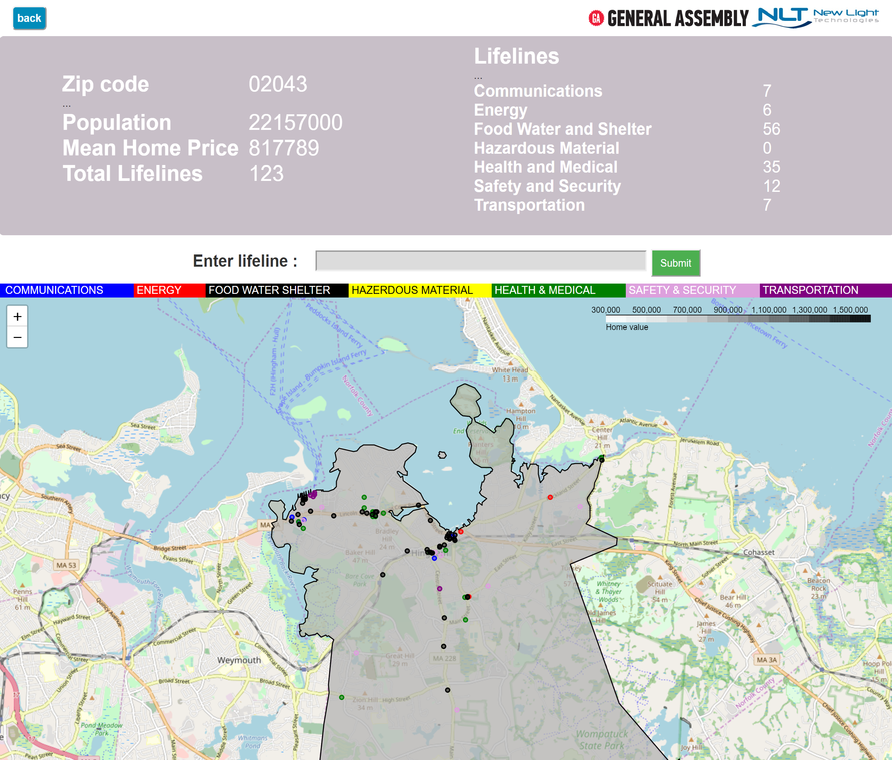
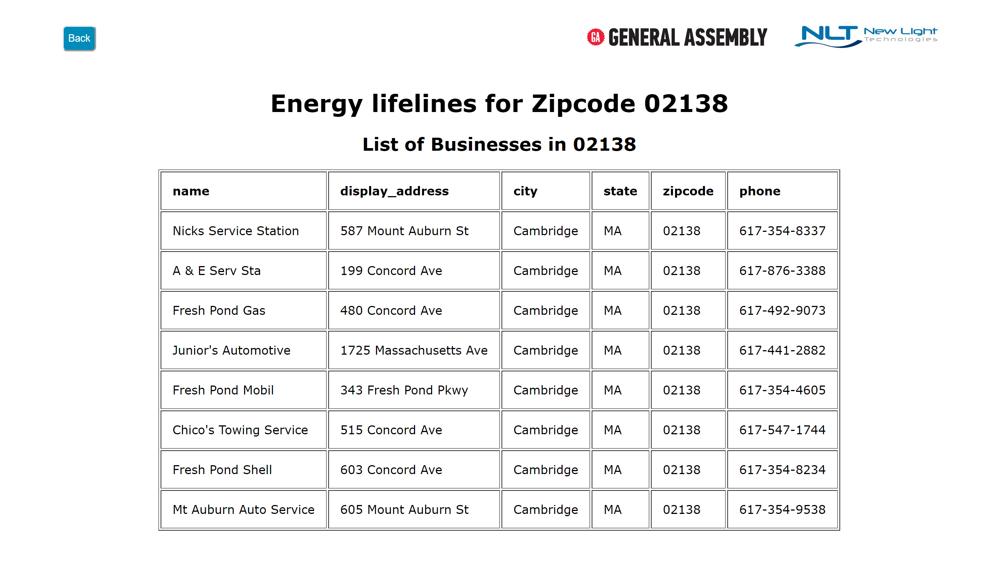

# FEMA Lifeline mapping through Yelp! scraping.

### Creating an updatable database and map of local businesses to supplement FEMA lifeline maps and databases
#### By
#### SJ Choi https://github.com/SJClarissa <br> Lena Nevel https://github.com/LenaNevel <br> Paul McKinley https://github.com/pdmckinley


## Table of Contents
- [1 Directory Structure](#1-Directory-Structure)<br>
- [2 Project Outline / Problem Statement](#2-Project-Outline-/-Problem-Statement)<br>
- [3 Description of Data](#3-Description-of-Data)<br>
 -[Size](#Size)<br>
 -[Source](#Source)<br>
 -[Data Dictionary](#Data-Dictionary)<br>
- [4 Data Visualization](#4-Data-Visualization)<br>
- [5 Conclusion](#5-Conclusion)<br>
- [6 Next Steps](#6-Next-Steps)<br>
- [7 Outside Sources](#7-Outside-Sources)<br>


## 1 Directory Structure

```
├── project_1
    ├── code
        ├── scraping_zillow.ipynb
        ├── combining_yelp_scrapes.ipynb
        ├── yelp_scraping.ipynb
    ├── data
        ├── final_yelp_scrape.csv
        ├── yelp_first_pass_cleaning.ipynb
        ├── yelp_first_pass_cleaning_zip_lena.ipynb
        ├── yelp_first_pass_cleaning_zip_paul.ipynb
        ├── yelp_first_pass_cleaning_zip_sj.ipynb
        ├── yelp_suffolk_186_first_pass_cleaning_zip.csv
        ├── zillow_w_na.csv
        ├── zipcodes_ma.geojson
        ├── zips_by_lifeline_count_loc_pop_zillow_1.4.csv
    ├── img
        ├── 01_home.png
        ├── 02_zipcode.png
        ├── 03_lifeline.png
    ├── static
        ├── css
            ├── main.css
        ├── GeneralAssembly.gif
        ├── ntl-color-logo.jpg     
    ├── templates
        ├── home.html
        ├── lifelines.html
        ├── map_boston.html
        ├── map_zipcode.html
        ├── zipcode.html
    ├── EXECUTIVE_SUMMARY.md
    ├── README.md
    ├── app_starter.py
    ├── geo_boston.py
    └── proj5 yelp.pdf
```

## 2 Project Outline / Problem Statement

FEMA uses community lifelines to create outcome-based, survivor-centric frames of reference to gauge disaster impact.  Although information on many lifelines is provided to FEMA through corresponding goverment agencies (Dept of Energy providing electrical grid information), many businesses could be categorized as lifelines but do not have a federal reporting agency that specifically keeps track of them.

The Yelp! business database allows us to gather data on businesses in a geographic area and categorize them into the FEMA lifeline categories as a supplement to already existing maps.  An area bounded by a 30km radius around Boston (zipcode 02110) was chosen as these areas are closely tied to Boston in terms of infrastructure, administration, and planning and any disaster to hit Boston would also deeply affect these communities.  Zillow home price and US Census population data were also gathered and mapped as steps to deeper projects.

---
## 3 Description of Data

### Size
- 8 .csv files and one .geojson file totaling 132mb of data.

### Source
- Yelp! data was scraped through their Fusion API, Zillow data was scraped through Quandl API, and population data was from the USZipcode python library which updates census info through various information sources.
- GeoJSON data was used from https://docs.digital.mass.gov/dataset/massgis-data-zip-codes-5-digit-here-navteq-0

### Data Dictionary

|Dataset|Feature|Type|Description|
|---|---|---|---|
| final_yelp_scrape.csv | lifeline | object | lifeline category |
| final_yelp_scrape.csv | name | object | name of the facility |
| final_yelp_scrape.csv | url | object | url |
| final_yelp_scrape.csv | phone | object | phone number |
| final_yelp_scrape.csv | distance | float64| distance from zipcode center |
| final_yelp_scrape.csv | price | object | price range ($, $$, $$$, $$$$) |
| final_yelp_scrape.csv | id | object | id of the facility |
| final_yelp_scrape.csv | zipcode | object | zipcode of the facility |
| final_yelp_scrape.csv | city | object | city of the facility |
| final_yelp_scrape.csv | state | object | state of the facility |
| final_yelp_scrape.csv | address1 | object | address of the facility |
| final_yelp_scrape.csv | address2 | object | address of the facility |
| final_yelp_scrape.csv | address3 | object | address of the facility |
| final_yelp_scrape.csv | display_address | object | primary address of the facility |
| final_yelp_scrape.csv | latitude | float64| latitude of the facility |
| final_yelp_scrape.csv | longitude | float64| longitude of the facility |
| final_yelp_scrape.csv | alias1 | object | biz category |
| final_yelp_scrape.csv | alias2 | object | biz category |
| final_yelp_scrape.csv | alias3 | object | biz category |
|---|---|---|---|
| OLD_all_zipcodes.csv | zipcode | int | Boston zipcodes |
|---|---|---|---|
| zillow_w_na.csv | zip | object | Boston zipcodes |
| zillow_w_na.csv | ZHVIAH | float64 | Zillow Home Value Index - All Homes |
| zillow_w_na.csv | ZHVIBT | float64 | Zillow Home Value Index - Bottom Tier |
| zillow_w_na.csv | ZHVIMT | float64 | Zillow Home Value Index - Middle Tier |
| zillow_w_na.csv | ZHVITT | float64 | Zillow Home Value Index - Top Tier |
| zillow_w_na.csv | MVALFAH | float64 | Median Value Per Square Foot - All Homes |
|---|---|---|---|
| zips_by_lifeline_count_loc_pop_zillow_1.2.csv | 	zipcode	|	object	| zipcodes |
| zips_by_lifeline_count_loc_pop_zillow_1.2.csv | 	communications	|	 int64	| category of communications lifeline |
| zips_by_lifeline_count_loc_pop_zillow_1.2.csv | 	communicationslat	|	 float64	| latitude to place a marker |
| zips_by_lifeline_count_loc_pop_zillow_1.2.csv | 	communicationslong	|	 float64	| longitude to place a marker |
| zips_by_lifeline_count_loc_pop_zillow_1.2.csv | 	energy	|	 int64	| category of energy lifeline |
| zips_by_lifeline_count_loc_pop_zillow_1.2.csv | 	energylat	|	 float64	| latitude to place a marker |
| zips_by_lifeline_count_loc_pop_zillow_1.2.csv | 	energylong	|	 float64	| longitude to place a marker |
| zips_by_lifeline_count_loc_pop_zillow_1.2.csv | 	food_water_shelter	|	 int64	| category of food_water_shelter lifeline |
| zips_by_lifeline_count_loc_pop_zillow_1.2.csv | 	food_water_shelterlat	|	 float64	| latitude to place a marker |
| zips_by_lifeline_count_loc_pop_zillow_1.2.csv | 	food_water_shelterlong	|	 float64	| longitude to place a marker |
| zips_by_lifeline_count_loc_pop_zillow_1.2.csv | 	hazmat	|	 int64	| category of hazardous material lifeline |
| zips_by_lifeline_count_loc_pop_zillow_1.2.csv | 	hazmatlat	|	 float64	| latitude to place a marker |
| zips_by_lifeline_count_loc_pop_zillow_1.2.csv | 	hazmatlong	|	 float64	| longitude to place a marker |
| zips_by_lifeline_count_loc_pop_zillow_1.2.csv | 	health_medical	|	 int64	| category of health_medical lifeline |
| zips_by_lifeline_count_loc_pop_zillow_1.2.csv | 	health_medicallat	|	 float64	| latitude to place a marker |
| zips_by_lifeline_count_loc_pop_zillow_1.2.csv | 	health_medicallong	|	 float64	| longitude to place a marker |
| zips_by_lifeline_count_loc_pop_zillow_1.2.csv | 	safe_sec	|	 int64	| category of safety and security lifeline |
| zips_by_lifeline_count_loc_pop_zillow_1.2.csv | 	safe_seclat	|	 float64	| latitude to place a marker |
| zips_by_lifeline_count_loc_pop_zillow_1.2.csv | 	safe_seclong	|	 float64	| longitude to place a marker |
| zips_by_lifeline_count_loc_pop_zillow_1.2.csv | 	transportation	|	 int64	| category of transportation lifeline |
| zips_by_lifeline_count_loc_pop_zillow_1.2.csv | 	transportationlat	|	 float64	| latitude to place a marker |
| zips_by_lifeline_count_loc_pop_zillow_1.2.csv | 	transportationlong	|	 float64	| longitude to place a marker |
| zips_by_lifeline_count_loc_pop_zillow_1.2.csv | 	population	|	 float64	| population in the zipcode |
| zips_by_lifeline_count_loc_pop_zillow_1.2.csv | 	zillowprice	|	 float64	| mean home value in the zipcode |
| zips_by_lifeline_count_loc_pop_zillow_1.2.csv | 	totallifelines	|	 int64	| number of total lifelines in the zipcode |

---

## 4 Data Visualization





---
## 5 Conclusion

- Yelp's own database and scrape limits make certain aspects of mapping difficult.  Businesses are limited to 3 self reported categories meaning that diverse resources such as hospitals might only appear as a single result and count towards lifelines, regardless of capacity.  Yelp's API is also quite unreliable, and frequently returns businesses significantly outside of the desired range. Significant data cleaning and checking can be required with broader category searches. Despite these shortcomings, 13,000 businesses in FEMA lifeline categories were mapped and could be potentially added to lifeline databases to help gauge disaster impact.


### 6 Next Steps

- Zillow and population data could be used for analysis into lifelines as relating to demographics.  As well, deeper categorization of results would be useful, as lifeline count might not be the best measure of lifeline quality within a community.  Does a dental office provide the same emergency relief as a hospital, or a small grocery store compared to a whosesale warehouse?  Lifeline capacity could also be a useful metric when measured against home value and population.  One zip code, town, or county could have quite a few health lifelines but what is their total capacity, and what percent of the community can it service in the event of a disaster?

---
## 7 Outside Sources

- https://www.fema.gov/media-library-data/1576770152678-87196e4c3d091f0319da967cf47ffd9c/CommunityLifelinesToolkit2.0v2.pdf
- https://www.fema.gov/lifelines
- https://en.wikipedia.org/wiki/Hanscom_Air_Force_Base
- https://en.wikipedia.org/wiki/2010_Boston_water_emergency
- https://www.yelp.com/developers/documentation/v3/all_category_list
- https://docs.digital.mass.gov/dataset/massgis-data-zip-codes-5-digit-here-navteq-0
- https://www.quandl.com/
- https://www.qgis.org/en/site/


```

```
